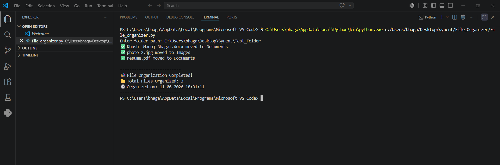

# Smart File Organizer

## Overview

Smart File Organizer is a Python-based automation tool that organizes files into categorized folders based on their file extensions. It helps maintain a clean and structured directory by automatically sorting files such as documents, images, videos, music, archives, and executable programs.

---

## Features

- Organizes Images, Documents, Videos, Music, Archives, and Programs
- Automatically creates folders if they do not exist
- Handles invalid folder paths
- Displays total files organized
- Shows date and time of organization

---

## Technologies Used

- Python
- OS Module
- Shutil Module
- Datetime Module

---

## How to Run

1. Clone or download the repository.

2. Open the project folder in VS Code or any Python IDE.

3. Run the Python script:

```bash
python File_organizer.py
```

4. Enter the path of the folder you want to organize when prompted.

5. The program will:
   - Automatically categorize files based on their extensions.
   - Create folders such as Images, Documents, Videos, Music, Archives, and Others.
   - Move files into their respective folders.
   - Display the total number of files organized along with the execution date and time.

6. Open the target folder to view the organized files.

---

## Output

- Files sorted into respective folders.
- Organization summary with timestamp.

---

## Sample Output



```text
- ✅ Khushi Manoj Bhagat.docx moved to Documents
- ✅ photo 2.jpg moved to Images
- ✅ resume.pdf moved to Documents
----------------------------------------------
- 🎉 File Organization Completed!
- 📁 Total Files Organized: 3
- 🕒 Organized on: 11-06-2026 15:04:57
```

---

## Future Enhancement

- GUI Interface using Tkinter
- Drag and Drop Support
- Automatic Background Monitoring
- Log File Generation

## Author

Khushi Bhagat

---
